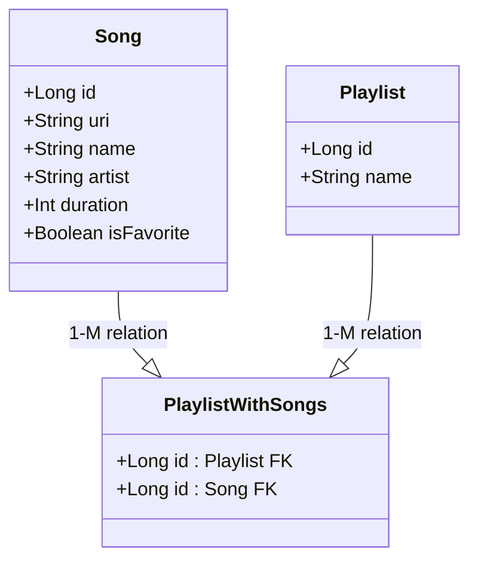

# Project requirements

- [x] Implement app navigation between screens
- [x] Display a list of songs using RecyclerView
- [x] Handle user preferences with SharedPreferences
- [x] Use an AlertDialog for user confirmation
- [x] Read and write song data to/from a local file
- [x] Play music using a ForegroundService
- [x] Git repository(minimum 10 commits)

---

# Description

This is music player app which fetches audio files from local device memory and plays them providing basic functionality

>[!NOTE]
>This project is made for final exam of subject "Mobile Development : Android"
>Formerly it was Laboratory Work 8 but then turned into final project

## Functionality

- Fetch songs from local memory
- Playback (prev, play/pause, next)
- Favorite songs
- Playlists
- Search

## Stack

- Java 21
- Gradle 8.10.2
- Room 2.7.0

## Database

Simple SQLite DB with Room ORM
Access the entities through DAOs

## Misc

### Services

There are two services:

BACKGROUND SERVICE
- Fetch audio files metadata and pass them into the DB
- WorkManager is used to schedule `MusicFetchWorker` for the service as one time job triggered on app start
- On initial app start it requires user to choose a folder to fetch audio files from, then the folder is saved into Shared Preferences

FOREGROUND SERVICE
- Music playback
- Uses `MediaPlayer` API
- Is controlled via `Intent`, plays the list of songs it obtained
- Inflates custom notification using `NotificationCompat.Builder`, `RemoteViews`

### In-app mini player

- Is made as standalone fragment
- `BroadcastReceiver` is used to pass all the necessary data to in-app mini player
- `Handler` is used to update the UI

### Shared Preferences

- Are used to store folder to pick audio files from

### Navigation

- Is used to enable cross-fragment navigation
- Navigate between pages Home and Search via bottom menu
- `Navigation.SafeArgs` is used to pass data through navigation Home -> Playlist
- Mini player is included in main activity layout

